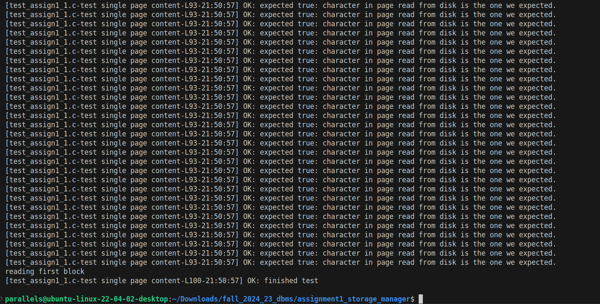

## Storage Manager

The goal of this program is to implement a storage manager with primary goal of reading blocks from a file on disk into memory and writing blocks from memory to a file on disk.


The storage manager should:
- handle pages (blocks) of fixed size (PAGE SIZE)
- create, open, and close files
- read and write pages from a file
- maintain several types of information for an open file, ie. 
    - the number of total pages in the file, 
    - the current page position (for reading and writing), 
    - the file name, and 
    - a POSIX file descriptor or FILE pointer. 
- implementation you should implement the interfaces in the `storage_mgr.h` file


## Technologies/Platforms/Tools Used 
1. C Programming Language
2. Ubuntu OS
3. Visual Studio Code
4. GCC Compiler
4. Valgrind


## Project File Structure

    ├── storage_mgr.c
    ├── storage_mgr.h
    ├── dberror.c
    ├── dberror.h
    ├── test_assign1_1.c
    ├── test_helper.h
    ├── Makefile
    └── README.md


## Compilation 
Using the Makefile, run command below to compile the program. This will create a "test_assign1" file.

```$ make```

## Execution
Run the generated executable `test_assign1` object file using the command below.

```$ ./test_assign1```

## Clean
Clean object file using the command below.

```$ make clean```

## Memory Leaks Verification
To verify memory leaks, run
```$ valgrind --leak-check=full ./test_assign1```

## Test and Memory Leaks Results
### Test results
 

### Memory leak results
 


## Program Key Components

### File Handle (`SM_FileHandle`)
- Represents an open paged file.
- Stores the file name, total number of pages in the file, and the current page position.
- Contains a `mgmtInfo` field to store additional implementation-specific information, such as a POSIX file descriptor.

### Page Handle (`SM_PageHandle`)
- A pointer to a memory area where a page’s data is stored.
- Methods that interact with the disk require this handle to point to a memory block at least `PAGE_SIZE` bytes long.


## Functionality

### File Management
- `createPageFile(char *fileName)`: Creates a new page file with an initial size of one page filled with zero bytes.
- `openPageFile(char *fileName, SM_FileHandle *fHandle)`: Opens an existing page file and initializes the file handle with the file's details.
- `closePageFile(SM_FileHandle *fHandle)`: Closes an open page file.
- `destroyPageFile(char *fileName)`: Deletes a page file from the disk.

### Reading pages from file into memory
- `readBlock(int pageNum, SM_FileHandle *fHandle, SM_PageHandle memPage)`: Reads a specific page from the file into memory.
- `getBlockPos(SM_FileHandle *fHandle)`: Returns the current page position in the file.
- `readFirstBlock(SM_FileHandle *fHandle, SM_PageHandle memPage)`: Reads the first page of the file.
- `readPreviousBlock(SM_FileHandle *fHandle, SM_PageHandle memPage)`: Reads the previous page relative to the current position.
- `readCurrentBlock(SM_FileHandle *fHandle, SM_PageHandle memPage)`: Reads the current page.
- `readNextBlock(SM_FileHandle *fHandle, SM_PageHandle memPage)`: Reads the next page relative to the current position.
- `readLastBlock(SM_FileHandle *fHandle, SM_PageHandle memPage)`: Reads the last page of the file.

### Writing pages from memory to file
- `writeBlock(int pageNum, SM_FileHandle *fHandle, SM_PageHandle memPage)`: Writes data to a specific page in the file.
- `writeCurrentBlock(SM_FileHandle *fHandle, SM_PageHandle memPage)`: Writes data to the current page position in the file.
- `appendEmptyBlock(SM_FileHandle *fHandle)`: Adds an empty page to the end of the file, filled with zero bytes.
- `ensureCapacity(int numberOfPages, SM_FileHandle *fHandle)`: Expands the file size if it contains fewer pages than `numberOfPages`.

## Data Structures

### `SM_FileHandle`
```c
typedef struct SM_FileHandle {
    char *fileName;
    int totalNumPages;
    int curPagePos;
    void *mgmtInfo;
} SM_FileHandle;
```

### `SM_PageHandle`
```c
typedef char *SM_PageHandle;
```

## Code Structure
The overview of the code is primarily divided has the following sections:

- File manipulation - methods to create, open, close, and delete files
- Reading pages - methods to read first, last, next, prev pages
- Writing pages - methods to write and append pages
- Helper methods - for getting current page position, ensuring capacity
