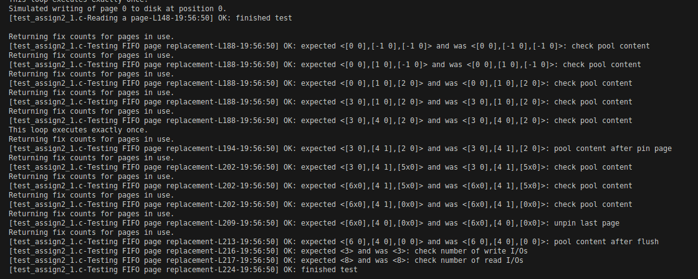

Here’s the README formatted in GitHub Markdown:

---

# CS525 - Advanced Database Organization  
## Assignment 2 - Buffer Manager

### Overview

In this assignment, a **Buffer Manager** will be implemented to manage blocks of data in memory, including reading from disk, flushing data to disk, and replacing blocks when needed. The Buffer Manager ensures efficient memory management by caching disk pages in memory and using page replacement strategies to determine which pages to keep and which to evict when space is required.

---
## Functionality and Concepts

### Buffer Manager

The buffer manager manages a fixed number of
pages in memory that represent pages from a page file managed by the **Storage Manager** implemented in previous assignment 1.

The memory pages managed by the Buffer Manager are called _page frames_ or _frames_ for short. The
combination of a page file and the page frames storing pages from that file is called a _Buffer Pool_ .
The buffer manager should be able to handle more than one open buffer pool at the same time.

### Buffer Pool

A **buffer pool** consists of a fixed number of page frames, each holding pages from a disk-based file. Clients can request pages by their number, and the buffer manager checks if the page is already in memory. If not, the buffer manager loads it into an available frame. 

### Page Replacement Strategies

When the buffer pool is full, the buffer manager uses a **page replacement strategy** to determine which page to evict:

- **FIFO (First-In, First-Out)**: The oldest page in memory is replaced.
- **LRU (Least Recently Used)**: The least recently accessed page is replaced.

### Pinning and Unpinning Pages

- **Pinning** a page loads it into memory and increments its fix count, preventing it from being evicted.
- **Unpinning** a page decrements the fix count, allowing it to be evicted if the fix count reaches 0.

### Dirty Pages

- **Dirty Pages** are modified pages that must be written to disk before eviction to prevent data loss.

---

## Requirements

1. **Multiple Buffer Pools**: The buffer manager should support multiple concurrent buffer pools, each associated with a unique page file.
2. **Page Replacement**: Implement FIFO and LRU page replacement strategies.
3. **Pinning/Unpinning Pages**: Track and manage the fix count of pages, ensuring pages are only evicted when no clients are using them.
4. **Memory Management**: Proper memory allocation and deallocation to avoid memory leaks.
5. **Mapping**: Maintain an efficient mapping of page numbers to frames for fast lookups.

---

## Project File Structure

The folder contains the following files:

```bash
├── buffer_mgr_stat.c
├── buffer_mgr_stat.h
├── buffer_mgr.c
├── buffer_mgr.h
├── dberror.c
├── dberror.h
├── dt.h
├── storage_mgr.c
├── storage_mgr.h
├── test_assign2_1.c
├── test_assign2_2.c
├── test_helper.h
├── Makefile
└── README.md
```

---

## Compilation

The project uses a `Makefile` for compilation. To compile the code, simply run the following command:

```bash
$ make
```

---

## Execution

After compiling the program, the test cases be run by executing the following commands:

```bash
$ ./test_assign2_1
$ ./test_assign2_2
```
To clean generated objects, run:
```bash
$ make clean
```

To test specific scenarios like the **LRU** page replacement strategy, I commented out the **FIFO** test cases in `test_assign2_1`.

## Test Results
Run `./test_assign2_1` to get test results for the various replacement policies. 

### LRU:

 


### FIFO:

 


### Clock:

 

---

## Verifying Memory Leaks

To verify memory leaks using `Valgrind` (on Linux), ensure `valgrind` is installed, and run the following commands:

```bash
$ valgrind --leak-check=full ./test_assign2_1
$ valgrind --leak-check=full ./test_assign2_2
```

This will provide detailed information about any memory leaks or issues during execution.

---

## Internal Code Implementation

### Solution Overview

The Buffer Manager performs the following core tasks:

- **Buffer Pool Management**: Caches disk pages in memory using a fixed-size buffer pool.
- **Page Handling**: Clients can request specific pages by page number, and the buffer manager checks if the page is cached. If not, the page is read from the disk.
- **Page Replacement**: If the buffer is full, a page replacement strategy (FIFO or LRU) determines which page to evict.
- **Pinning and Unpinning Pages**: Ensures that pages requested by clients are pinned in memory, allowing modifications or reads. Unpinning allows the buffer manager to evict the page when necessary.
- **Dirty Pages**: Manages pages that have been modified (dirty) and ensures that these pages are written back to disk before being evicted.

### Data Structures

1. **BM_BufferPool**: Stores buffer pool details such as the page file name, number of frames, replacement strategy, and related data.
2. **BM_PageHandle**: Represents a page, including its page number and a pointer to the memory storing the data.

### Key Features

1. **Efficient Page Lookup**: The buffer manager maintains a mapping between page numbers and frames for efficient lookups.
2. **Concurrency**: Although thread safety is not implemented in this version, the buffer manager assumes concurrent use by multiple components in a DBMS.
3. **Memory Management**: Ensures proper memory allocation and deallocation, minimizing memory leaks.

---

## Code Structure Implementation

### Buffer Pool Methods

- **initBufferPool()**: Initializes a buffer pool using a specified page replacement strategy.
- **shutdownBufferPool()**: Shuts down the buffer pool, releasing all resources.
- **forceFlushPool()**: Writes all dirty pages to disk.

### Page Management Methods

- **pinPage()**: Pins a page into memory, allowing access and modification.
- **unpinPage()**: Unpins a page, indicating it's no longer needed by the client.
- **markDirty()**: Marks a page as modified.
- **forcePage()**: Forces a dirty page to be written back to disk.

### Statistics Functions

- **getFrameContents()**: Returns the contents of the frame.
- **getDirtyFlags()**: Returns the dirty status of frames.
- **getFixCounts()**: Returns the fix counts for pages.
- **getNumReadIO() / getNumWriteIO()**: Returns the number of read and write I/O operations performed.

---

## Optional Extensions

For additional credit, I may:

1. **Implement Thread Safety**: Ensure the buffer pool can handle concurrent access safely.
2. **Implement More Page Replacement Strategies**: Consider adding CLOCK or LRU-k strategies for enhanced functionality.

