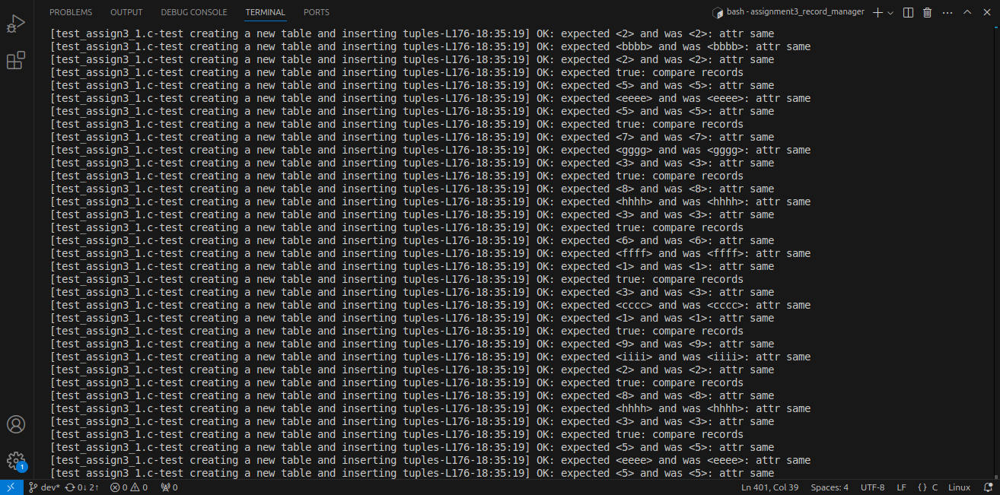
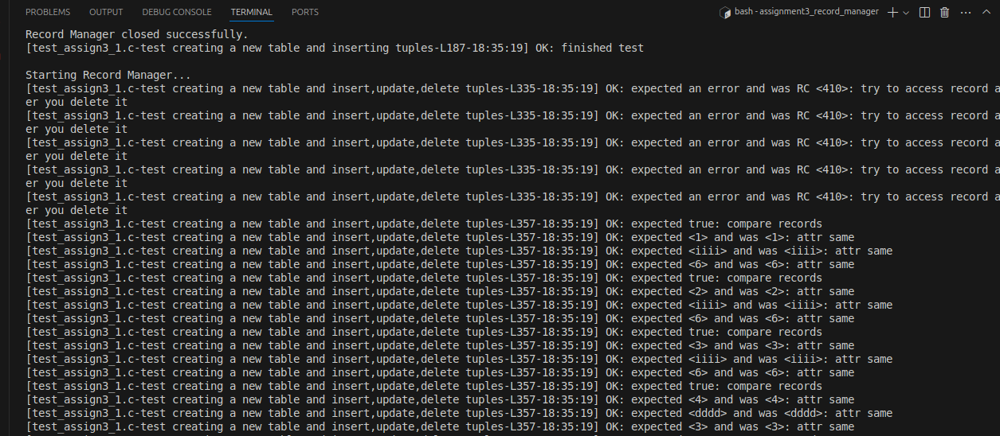
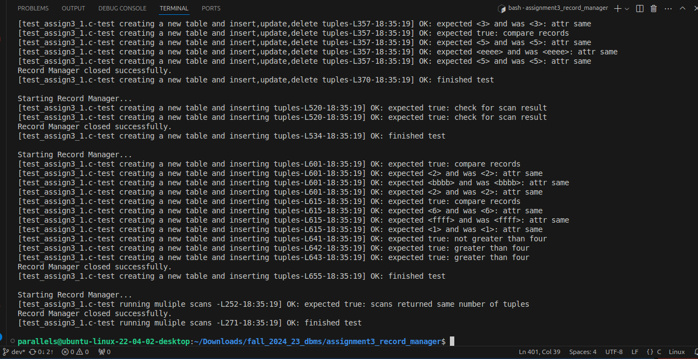

# Record Manager - CS 525 Advanced Database Organization (Fall 2024)

## Project Overview

This project is a **Record Manager** that allows manipulation of records within a table using a fixed schema. It provides fundamental database functionalities, such as:
- Inserting, updating, and deleting records.
- Scanning tables with search conditions.
- Managing tables with efficient page layouts and free space management.
  
The Record Manager interfaces with a **Buffer Manager** (from the previous assignment) to handle paging. This program also incorporates schema definition, record identification, and memory management.


## Features

### 1. Record Representation
- Fixed-length records based on a predefined schema.
- Record IDs (RIDs) uniquely represent records with a combination of page and slot numbers.

### 2. Page Layout & Free Space Management
- Records are stored in pages, with each page designed to manage entries and free space efficiently.
- Free space tracking implemented via linked lists or a directory in the page file.

### 3. Schemas and Data Types
- Schema definitions include attributes, data types, and key attributes.
- Supports four data types: Integer (`DT_INT`), Float (`DT_FLOAT`), String (`DT_STRING`), and Boolean (`DT_BOOL`).

### 4. Expression Evaluation
- Logical and comparison operations for filtering records during scans.
- Supports operators such as AND, OR, NOT, EQUALS, and LESS THAN.

## Code Structure

- **`tables.h`**: Defines core data structures (`Schema`, `Record`, `RID`, `Value`) and utility macros for serializing data structures.
- **`expr.h`**: Provides data structures and functions for constructing and evaluating expressions used in scans.
- **`record_mgr.h`**: The primary interface for the Record Manager, handling table management, record operations, scans, and schema and attribute management.

## Functions

### Table Management
- `initRecordManager`: Initializes the Record Manager.
- `createTable`: Creates a table with a specified schema.
- `openTable` / `closeTable`: Opens or closes an existing table.
- `deleteTable`: Deletes an existing table.
- `getNumTuples`: Returns the number of tuples in a table.

### Record Operations
- `insertRecord`: Inserts a record and assigns an RID.
- `deleteRecord`: Deletes a record by RID.
- `updateRecord`: Updates an existing record.
- `getRecord`: Retrieves a record by RID.

### Scan Operations
- `startScan`: Initiates a scan with optional conditions.
- `next`: Retrieves the next record that matches the scan condition.
- `closeScan`: Closes the scan and releases resources.

### Schema and Attribute Functions
- `getRecordSize`: Returns the byte size of a record based on the schema.
- `createSchema`: Creates a new schema with specified attributes and keys.
- `getAttr` / `setAttr`: Gets or sets attribute values in records.


## Directory Structure

```
assign3/
│── Makefile
│── buffer_mgr.h
│── buffer_mgr.c
│── buffer_mgr_stat.c
│── dberror.c
│── dberror.h
│── expr.c
│── expr.h
│── record_mgr.h
│── record_mgr.c
│── rm_serializer.c
│── storage_mgr.h
│── storage_mgr.c
│── tables.h
│── test_assign3_1.c
│── test_expr.c
│── test_helper.h
│── README.md
```

## Testing

- **test_helper.h**: Helper functions for assertions in test cases.
- **test_expr.c**: Tests for expression handling (`expr.h` interface).
- **test_assign3_1.c**: Tests for record management (`record_mgr.h` interface).

## Compilation and Running Tests

Use the provided **Makefile** to compile the project:
```bash
$ make
```

To run test, run command:
```bash
$ ./test_assign3
```

## Test Results
 

 

 


## Development Notes

- Prior to development, design the data structures and overall architecture carefully.
- Ensure proper memory allocation, especially for serialized data structures.
- Utilize the buffer and storage manager implementations from previous assignments.
