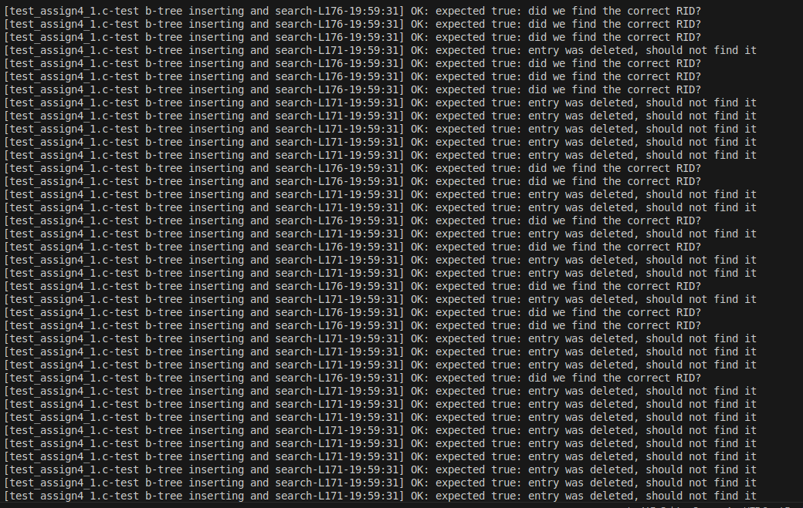
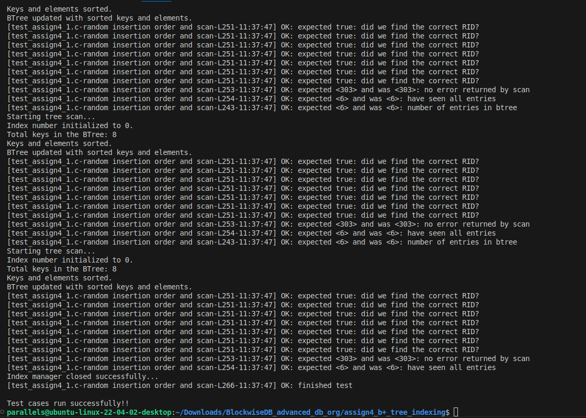

# B+ Tree Implementation with Buffer Manager

## Introduction

The goal is to implement a B+ Tree index structure, which is a self-balancing tree data structure designed for indexing large amounts of data in a way that allows efficient insertion, deletion, and search operations. The index should be backed by a page file, with pages of the index being managed through a buffer manager. This implementation is for integer keys (DT_INT) and focuses on the core operations of insertion, deletion, and key lookup, while supporting B+ tree-specific behaviors like node splitting and underflow handling.

## Functional Requirements

1. **Insertions**: Insert keys into the B+ Tree in sorted order. Handle leaf node splits and non-leaf node splits correctly.
2. **Deletions**: Remove keys and corresponding record pointers from the B+ Tree. Handle underflows by redistributing keys from neighboring siblings or merging nodes.
3. **Search**: Look up keys in the B+ Tree and retrieve corresponding record pointers (RIDs).
4. **Tree Traversal**: Support scanning through the B+ Tree in sorted order.
5. **Debugging**: Provide a `printTree` function to output a string representation of the B+ Tree for debugging purposes.

## Features

### Tree Operations
- **InsertKey**: Insert a new key into the B+ Tree and manage node splits and overflow.
- **DeleteKey**: Remove a key from the tree, handle underflows, and perform redistributions or node merges as necessary.
- **FindKey**: Retrieve the record ID (RID) corresponding to a given key.
- **OpenTreeScan** and **NextEntry**: Allow for scanning through the B+ Tree in sorted order.

### Node Splitting and Merging
- **Leaf Node Split**: When a leaf node is full, the new key should be inserted into the left node if the number of elements (`n`) is even. If `n` is odd, the keys are split evenly between the left and right nodes.
- **Non-Leaf Node Split**: For non-leaf nodes, if the node is full and `n` is odd, the middle value is moved to the parent node.
- **Underflow Handling**: When a node has too few keys, the algorithm attempts to redistribute keys from siblings. If redistribution is not possible, the node is merged with a sibling, preferably the left sibling.

### Debugging and Testing
- **PrintTree**: Generates a string representation of the B+ Tree in depth-first, pre-order traversal.
- **Test Cases**: Includes test cases for inserting, deleting, and scanning keys within the tree. These tests help verify that the B+ Tree implementation adheres to the expected behavior.

## Project Structure

The source code is organized as follows:

```
assign4/
├── Makefile
├── btree_mgr.c
├── btree_mgr.h
├── buffer_mgr.c
├── buffer_mgr.h
├── dberror.c
├── dberror.h
├── dt.h
├── expr.c
├── expr.h
├── record_mgr.c
├── record_mgr.h
├── rm_serializer.c
├── storage_mgr.h
├── tables.h
├── test_assign4_1.c
├── test_expr.c
├── test_helper.h
└── README.md
```

### Key Files
- **btree_mgr.c** and **btree_mgr.h**: Implement the core B+ Tree functionality, including insertion, deletion, searching, and debugging.
- **buffer_mgr.c** and **buffer_mgr.h**: Manage the reading and writing of pages from disk to memory. These files implement the buffer manager that ensures that pages are properly cached.
- **dberror.c** and **dberror.h**: Handle error codes and messages used throughout the project.
- **tables.h**: Defines the data structures used for the database records and keys.
- **test_assign4_1.c**: Contains test cases for the B+ Tree implementation, including insertion and scanning.
- **test_expr.c**: Contains tests for expressions and general functionality.

## Key Functions

### B+ Tree Manager Interface (btree_mgr.h)

- **initIndexManager**: Initializes the index manager.
- **shutdownIndexManager**: Shuts down the index manager and frees resources.
- **createBtree**: Creates a new B+ Tree index.
- **openBtree**: Opens an existing B+ Tree index.
- **closeBtree**: Closes a B+ Tree index and flushes modified pages to disk.
- **deleteBtree**: Deletes a B+ Tree index and its associated pages.
- **getNumNodes**: Returns the number of nodes in the B+ Tree.
- **getNumEntries**: Returns the number of entries in the B+ Tree.
- **getKeyType**: Returns the type of keys in the B+ Tree.

### B+ Tree Operations

- **findKey**: Finds the RID for a given key. Returns an error if the key is not found.
- **insertKey**: Inserts a new key and its corresponding RID. Returns an error if the key already exists.
- **deleteKey**: Deletes a key and its corresponding RID.
- **openTreeScan**: Opens a scan for iterating over entries in the B+ Tree.
- **nextEntry**: Retrieves the next entry in a tree scan.
- **closeTreeScan**: Closes a tree scan.

### Debugging

- **printTree**: Prints a depth-first, pre-order traversal of the tree. This function is useful for verifying the tree structure during testing.


## Compilation and Running Tests

Use the provided **Makefile** to compile the project:
```bash
make
```

To run test, run command:
```bash
./test_assign4_1
```

## Test Results
 
 


## Example Usage

### Inserting Keys
```c
BTreeHandle *tree;
openBtree(&tree, "my_tree");

// Insert a key with a corresponding RID
Value key;
key.v.intV = 5;
RID rid = {.page = 1, .slot = 1};
insertKey(tree, &key, rid);
```

### Scanning the Tree
```c
BT_ScanHandle *scanHandle;
openTreeScan(tree, &scanHandle);
RID result;
int rc;
while ((rc = nextEntry(scanHandle, &result)) == RC_OK) {
    printf("Found RID: %d.%d\n", result.page, result.slot);
}
closeTreeScan(scanHandle);
```

### Deleting a Key
```c
Value key;
key.v.intV = 5;
deleteKey(tree, &key);
```

## Optional Extensions

1. **Integration with Record Manager**: Allow the B+ Tree to be integrated with the record manager to use the B+ Tree for indexing record attributes.
2. **Support for Multiple Data Types**: Modify the B+ Tree to support additional data types for keys, such as strings or floats.
3. **Pointer Swizzling**: Implement pointer swizzling to replace page pointers with actual memory pointers for performance.
4. **Multiple Entries per Key**: Modify the B+ Tree to allow multiple RIDs for a single key.

## Conclusion

This assignment implements a B+ Tree with full support for insertion, deletion, and search operations, along with the ability to handle tree node splits, underflows, and other B+ Tree-specific behaviors. The project is structured for ease of testing and debugging, and it can be extended to support additional features like multiple key types and record manager integration.
